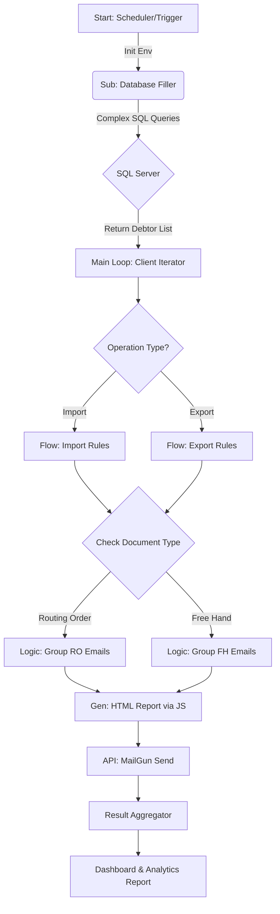

# ⚔️ Debt Terminator

> **Enterprise Debt Recovery Automation**
> *Stack: n8n · SQL Server · Docker · JavaScript · MailGun*

The **Debt Terminator** is a hyperautomation ecosystem designed to orchestrate the entire debt collection lifecycle for **CRAFT**. By integrating directly with the ERP via SQL Server, 
this system autonomously identifies, categorizes, and notifies clients regarding outstanding balances for international logistics services (Import/Export), drastically reducing Days Sales
Outstanding (DSO) and eliminating manual financial friction.

---

## 🏗️ System Architecture

The solution utilizes a modular **Microservices Architecture** within n8n. Each functional requirement (Data Extraction, Business Logic, Communication) is isolated into specific workflows to ensure high maintainability and horizontal scalability.

---

## ⚙️ The Workflow Engine

The system operates on a continuous validation cycle, segmented into three critical phases:

### 1. Data Ingestion & Hygiene (ETL) 🎲

Before any engagement, the system executes a rigorous **Data Quality** process:

* **SQL Extraction:** Executes complex queries (`JOINs` across `Chegada`, `HouseAdi`, `Reserva` tables) to detect processes with pending payments (`COLLECT` or `PREPAID`).
* **Exclusion Layer:** Applies a suppression filter based on a "Non-Debitable" table to ensure sensitive clients or litigious processes are strictly excluded from automated communications.
* **Data Injection:** Populates staging tables for high-speed processing, decoupling the automation from the production database load.

### 2. Decision Core (The Brain) 🧠

The engine iterates through each unique client entity, applying dynamic business rules based on the logistics modality:

#### 🚢 Import Flow (Inbound)

* **Routing Order (RO) Validation:** Performs integrity checks on contact data. If email discrepancies are detected for a single client entity, the system **halts execution** for that record and logs an inconsistency report (Proactive Error Handling).
* **Free Hand (FH) Aggregation:** consolidating multiple processes into a single, cohesive email notification to prevent spam, generating dynamic HTML tables via JavaScript.

#### 🛫 Export Flow (Outbound)

* **Compliance & Audit:** Ensures all outbound communications include a hidden compliance copy (`CC`) for internal auditing purposes.
* **Fallback Strategy:** If no valid contact data is found, the client is flagged for manual review in the final execution report.

### 3. Observability & Reporting 📊

Upon completion of the batch processing:

1. **Executive Dashboard:** A JavaScript worker consolidates financial metrics (Total Recoverable Amount in R$/USD/EUR, Headcount of Debtors).
2. **Inconsistency Logs:** Generates granular files (JSON/XLSX) detailing data failures for the Master Data Management team.
3. **Admin Alert:** Pushes a high-level report to the Product Owner via email/Slack.

---

## 🛠️ Tech Stack & Highlights

* **n8n (Self-Hosted):** Low-code orchestration with custom **High-code** function blocks for complex data manipulation.
* **SQL Server & T-SQL:** Optimized queries designed for performance on large financial datasets.
* **JavaScript (ES6+):** heavily used within n8n nodes for JSON parsing, HTML Template generation, and conditional logic.
* **Docker:** Containerization ensures environment consistency (Dev/Prod parity).
* **MailGun API:** Transactional email gateway ensuring high deliverability rates.

---

## 🤝 Credits & Acknowledgments

This project was a collaborative effort focused on operational excellence.

* **Architecture & Development:** Paulo Raphael Silva Brito
* **SQL & Database Optimization:** Elienai Neves, Sergio Seo & Lucas Leal
* **Infrastructure & Mentorship:** Lucas Scheid & Renato Casagrande

---

> *"Efficiency is doing better what is already being done."*
